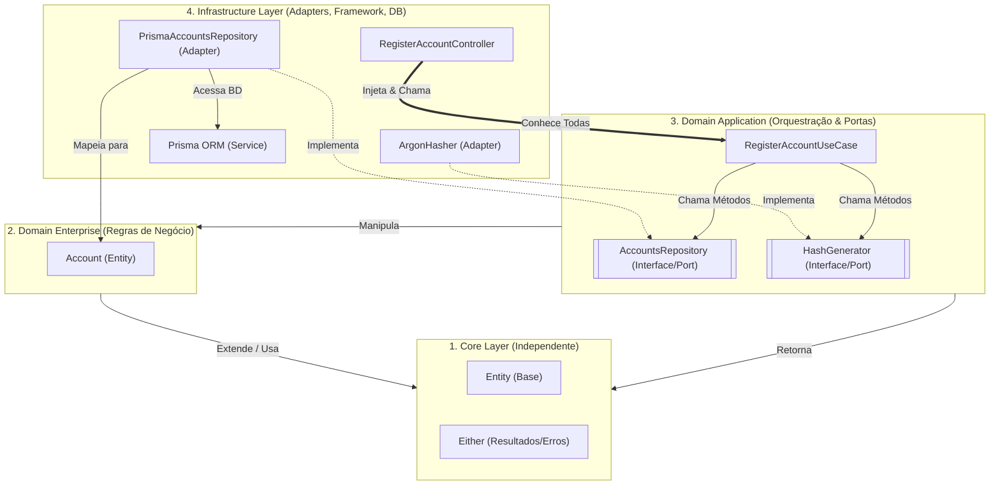
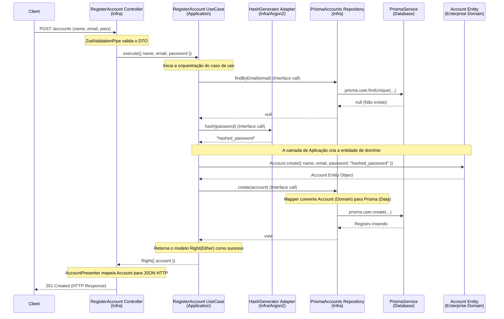

# Architecture Connections & Flow

Este documento detalha **como as camadas interagem entre si**. Ele inclui um diagrama de grafos focado no fluxo de dependências (Dependency Inversion Principle do Clean Architecture) e um diagrama de sequência que exemplifica o fluxo de execução ocorrendo através de todas as camadas.

## 1. Fluxo de Dependências (Clean Architecture)
O diagrama abaixo ilustra a Inversão de Dependência (DIP). A camada de Infraestrutura *depende* das abstrações definidas na camada de Aplicação. A Aplicação não conhece o banco de dados nem o framework web.

## 2. Fluxo de Execução (Runtime Sequence Diagram)
Para entender de forma prática como as camadas se conectam em tempo de execução, veja o fluxo de uma requisição HTTP percorrendo todas as camadas do sistema até o banco de dados e retornando uma resposta segura (Either).

