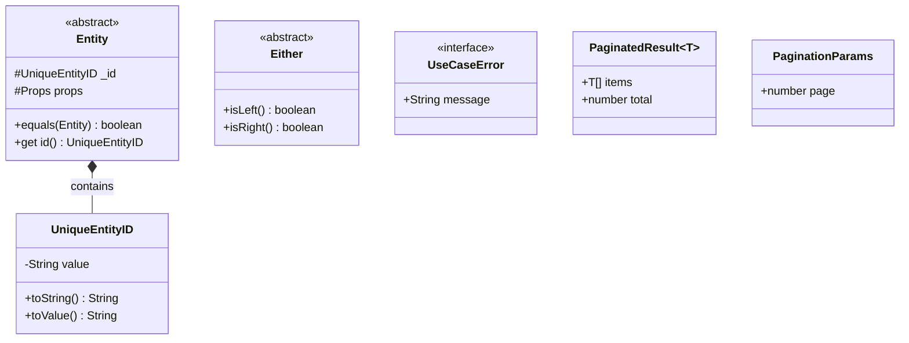
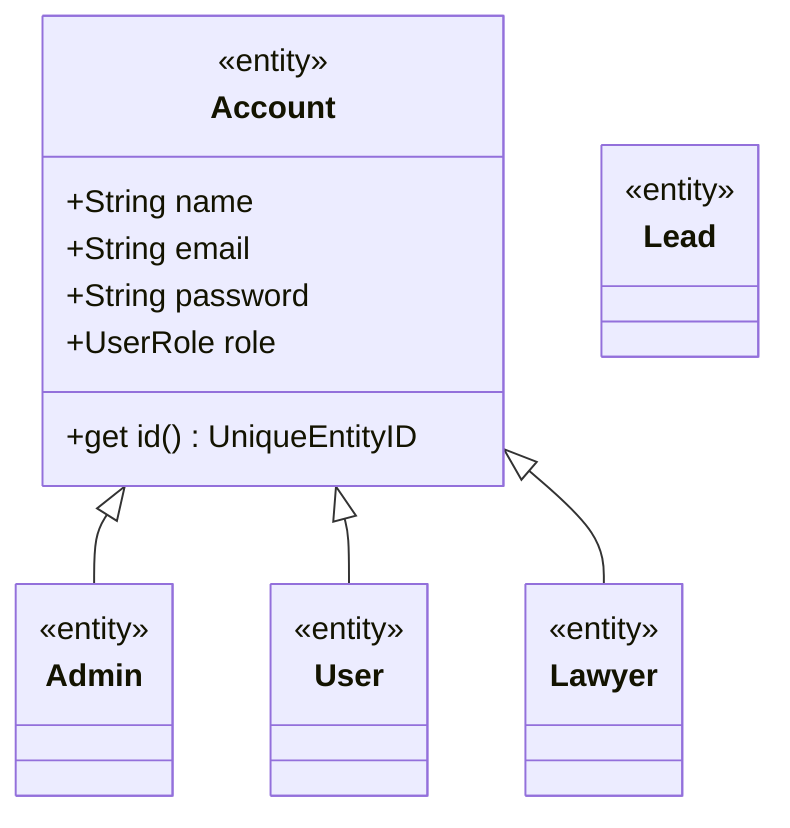
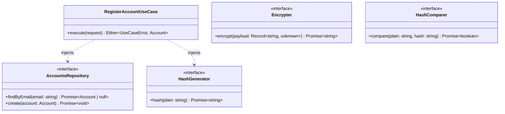
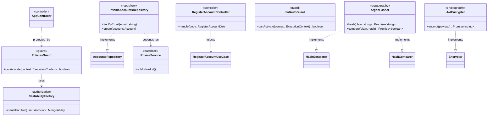

# Architecture Diagram

This document divides the architecture into detailed, focused diagrams representing each layer of the Domain-Driven Design (DDD) implementation.

## 1. Core Layer
Contains pure, foundational abstractions and standard types shared across all domains (such as Base Entities, IDs, and Result patterns).

## 2. Domain (Enterprise) Layer
Represents the core business models, ensuring that business rules and invariants are encapsulated.

## 3. Domain (Application) Layer
Acts as the bridge between outer layers and the enterprise domain. Contains Use Cases, Port Interfaces (Repositories, Cryptography), and Application logic.

## 4. Infrastructure Layer
The outermost layer consisting of framework implementation (NestJS), actual database access (Prisma), HTTP routing (Controllers), and Authorization rules (CASL).

