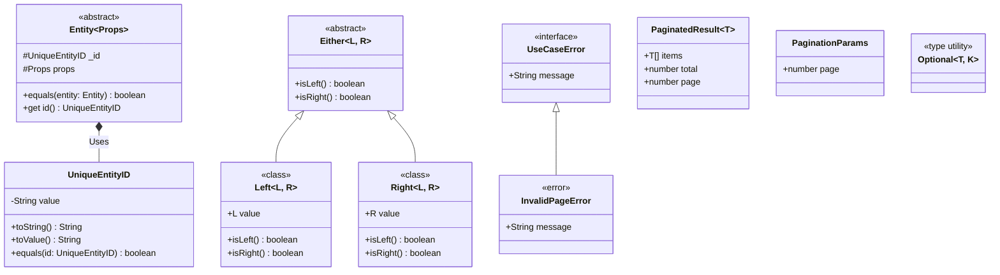
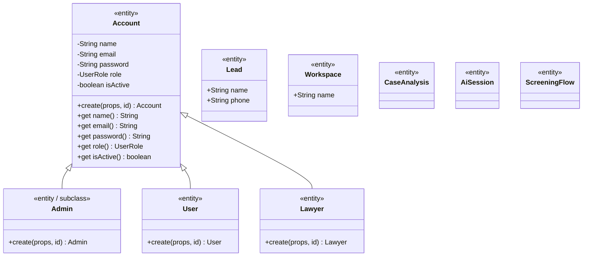
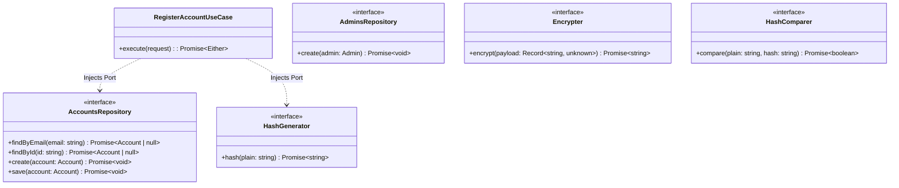

# Architecture Diagram

This document divides the architecture into highly detailed, focused diagrams representing each layer of the Domain-Driven Design (DDD) and Clean Architecture implementation.

## 1. Core Layer
Contains pure abstractions, error handling, utilities, and standard types shared across all domains. This layer has zero external dependencies.

## 2. Domain (Enterprise) Layer - IAM & Models
Represents the core business entities, aggregates, and value objects. Encapsulates all invariants and core business rules.

## 3. Domain (Application) Layer - IAM Use Cases & Ports
Contains the Application logic (Use Cases). Act as orchestrators defining what the system does. Depends on inner (Enterprise) layers and defines interfaces (Ports) for the outer layers to implement.

## 4. Infrastructure Layer - NestJS App
The outermost layer. Contains frameworks, databases (Prisma), web servers (Controllers, HTTP), adapters (Presenters, Mappers, Implementation of Repos/Cryptography), and Authorization (CASL).

```mermaid
classDiagram
  %% Modules
  class AppModule { <<module>> }
  class AuthModule { <<module>> }
  class CaslModule { <<module>> }
  class CryptographyModule { <<module>> }
  class DatabaseModule { <<module>> }
  class HttpModule { <<module>> }
  class EnvModule { <<module>> }

  %% Controllers & HTTP
  class RegisterAccountController {
    <<controller>>
    -ZodValidationPipe validationPipe
    +handle(body: RegisterAccountDto)
  }
  class AccountPresenter {
    <<presenter>>
    +toHTTP(account: Account) any
  }
  
  %% Database & Mappers
  class PrismaService {
    <<database>>
    +onModuleInit()
    +onModuleDestroy()
  }
  class PrismaAccountsRepository {
    <<repository adapter>>
    +findByEmail(email)
    +findById(id)
    +create(account)
    +save(account)
  }
  class PrismaAccountMapper {
    <<mapper>>
    +toDomain(raw: any) Account
    +toPrisma(account: Account) any
  }

  %% Cryptography Adapters
  class ArgonHasher {
    <<adapter>>
    +hash(plain) Promise~string~
    +compare(plain, hash) Promise~boolean~
  }
  class JwtEncrypter {
    <<adapter>>
    -JwtService jwtService
    +encrypt(payload) Promise~string~
  }

  %% Security & CASL
  class CaslAbilityFactory {
    <<factory>>
    +createForUser(user: Account) MongoAbility
  }
  class PoliciesGuard {
    <<guard>>
    -Reflector reflector
    -CaslAbilityFactory caslAbilityFactory
    +canActivate(context: ExecutionContext) boolean
  }
  class JwtAuthGuard {
    <<guard>>
    +canActivate(context: ExecutionContext) boolean
  }
  class JwtStrategy {
    <<strategy>>
    -EnvService env
    +validate(payload) any
  }
  class CheckPolicies {
    <<decorator>>
  }
  class CurrentUser {
    <<decorator>>
  }

  %% Structural / NestJS Dependencies
  AppModule *-- AuthModule
  AppModule *-- HttpModule
  AppModule *-- DatabaseModule
  AppModule *-- EnvModule
  
  AuthModule *-- CaslModule
  HttpModule *-- CryptographyModule
  HttpModule *-- DatabaseModule
  
  %% Adapter Implementations
  PrismaAccountsRepository ..|> AccountsRepository : Implements
  ArgonHasher ..|> HashGenerator : Implements
  ArgonHasher ..|> HashComparer : Implements
  JwtEncrypter ..|> Encrypter : Implements
  
  %% Inner component relationships
  RegisterAccountController ..> RegisterAccountUseCase : Injects/Uses
  RegisterAccountController ..> AccountPresenter : Uses
  PrismaAccountsRepository ..> PrismaService : Injects
  PrismaAccountsRepository ..> PrismaAccountMapper : Uses
  PoliciesGuard ..> CaslAbilityFactory : Injects
  JwtStrategy ..> EnvService : Injects
```

